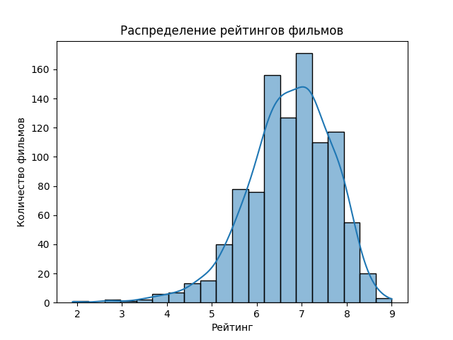

# 🎬 Анализ фильмов IMDb

Этот проект — мой первый мини-EDA на Python с использованием библиотек `pandas`, `matplotlib` и `seaborn`.

## 📂 Датасет
Использован датасет [IMDb Movie Data](https://www.kaggle.com/datasets/PromptCloudHQ/imdb-data).

## 📊 Что сделано
- Загружены и изучены данные о фильмах.
- Посчитан **средний рейтинг фильмов**.
- Определено количество фильмов жанра **Action**.
- Найден фильм с **максимальной прибылью**.
- Посчитана **средняя длительность фильмов**.
- Построена гистограмма распределения рейтингов.

## 🛠 Использованные технологии
- Python 3
- Pandas
- Matplotlib
- Seaborn
- Jupyter Notebook

## 📈 Примеры графиков

## 🚀 Результат
Этот проект демонстрирует базовые навыки анализа данных и визуализации.  
Он может быть использован как портфолио для фриланса или стажировок.
